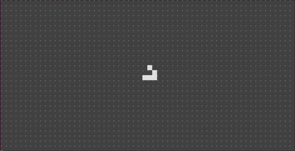

# Game of Live

A Conway's Game of Live kata in Rust.



The universe of the Game of Life is an infinite, two-dimensional orthogonal grid of square cells, each of which is in one of two possible states, live or dead (or populated and unpopulated, respectively). Every cell interacts with its eight neighbours, which are the cells that are horizontally, vertically, or diagonally adjacent.

## Rules

From: <https://en.wikipedia.org/wiki/Conway%27s_Game_of_Life>

 At each step in time, the following transitions occur:

- Any live cell with fewer than two live neighbours dies, as if by underpopulation.
- Any live cell with two or three live neighbours lives on to the next generation.
- Any live cell with more than three live neighbours dies, as if by overpopulation.
- Any dead cell with exactly three live neighbours becomes a live cell, as if by reproduction.

These rules, which compare the behaviour of the automaton to real life, can be condensed into the following:

- Any live cell with two or three live neighbours survives.
- Any dead cell with three live neighbours becomes a live cell.
- All other live cells die in the next generation. Similarly, all other dead cells stay dead.

The initial pattern constitutes the seed of the system. The first generation is created by applying the above rules simultaneously to every cell in the seed, live or dead; births and deaths occur simultaneously, and the discrete moment at which this happens is sometimes called a tick. The simultaneity means that when each cell counts the number of live neighbors around it, it uses its neighbors' old states before the update, not their new states after the update. If the cells are instead updated in reading order, so that each cell uses the old states of the cells to its right and below it but the new states of the cells to its left and above it, different cellular automaton results, which is known as NaiveLife because it is a common beginners' mistake among people attempting to program Conway's Game of Life.

Each generation is a pure function of the preceding one. The rules continue to be applied repeatedly to create further generations.

## Commands

Run:

```s
cargo run
```

Run tests:

```s
cargo test
```

## TODO

- Add a new `Grid` constructor from `String` with the same text of the render output. It could be the trait to convert from and into String.
- Add a gif in this README playing the game.

## Ideas

- A new grid function `grid_expand` could be used to expand a pattern grid. It could be implemented internally with `grip_overlap`. It expands from the grid center.
- Implement an iterator for the Grid that gives you a pair `(CellCoordinates, &Cell)`. To avoid double loop and make it more functional.
- Create a toroidal array and use it like the container in the grid.
