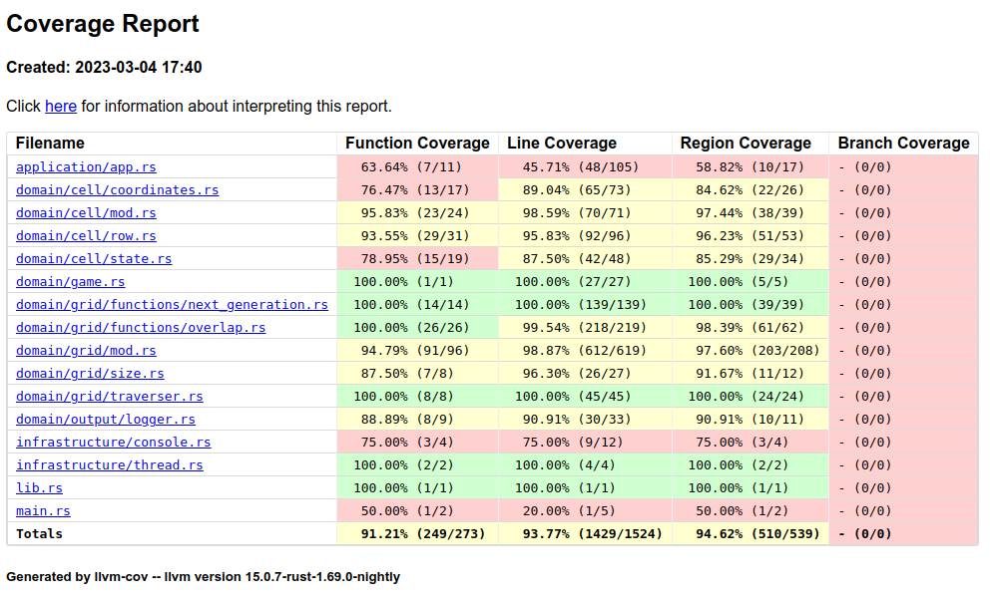

# Game of Live

[](https://github.com/josecelano/game-of-life/actions/workflows/test.yml) [](https://github.com/josecelano/game-of-life/actions/workflows/publish_crate.yml)

A [Conway's Game of Live](https://en.wikipedia.org/wiki/Conway%27s_Game_of_Life) kata in [Rust](https://www.rust-lang.org/).


The universe of the Game of Life is an infinite, two-dimensional orthogonal grid of square cells, each of which is in one of two possible states, live or dead (or populated and unpopulated, respectively). Every cell interacts with its eight neighbours, which are the cells that are horizontally, vertically, or diagonally adjacent.

## Rules

From: <https://en.wikipedia.org/wiki/Conway%27s_Game_of_Life>

 At each step in time, the following transitions occur:

- Any live cell with fewer than two live neighbours dies, as if by underpopulation.
- Any live cell with two or three live neighbours lives on to the next generation.
- Any live cell with more than three live neighbours dies, as if by overpopulation.
- Any dead cell with exactly three live neighbours becomes a live cell, as if by reproduction.

These rules, which compare the behaviour of the automaton to real life, can be condensed into the following:

- Any live cell with two or three live neighbours survives.
- Any dead cell with three live neighbours becomes a live cell.
- All other live cells die in the next generation. Similarly, all other dead cells stay dead.

The initial pattern constitutes the seed of the system. The first generation is created by applying the above rules simultaneously to every cell in the seed, live or dead; births and deaths occur simultaneously, and the discrete moment at which this happens is sometimes called a tick. The simultaneity means that when each cell counts the number of live neighbors around it, it uses its neighbors' old states before the update, not their new states after the update. If the cells are instead updated in reading order, so that each cell uses the old states of the cells to its right and below it but the new states of the cells to its left and above it, different cellular automaton results, which is known as NaiveLife because it is a common beginners' mistake among people attempting to program Conway's Game of Life.

Each generation is a pure function of the preceding one. The rules continue to be applied repeatedly to create further generations.

## Commands

### Run

```s
cargo run
```

The app will show you the available options, for example:

```s
cargo run ./patterns/glider.txt 30 60 1000 1
```

That command will run the `glider` pattern in a `30`x`60` background grid for `1000` generations with a generation lifetime of `1` second.

### Run tests

```s
cargo test
```

### Run Clipply

```s
cargo clippy --all-targets -- -D clippy::pedantic
```

### Coverage report

Text report:

```s
cargo cov
cargo llvm-cov --lib <- Exclude integration tests
```

It generates a text coverage report like this:

```s
Filename                                     Regions    Missed Regions     Cover   Functions  Missed Functions  Executed       Lines      Missed Lines     Cover    Branches   Missed Branches     Cover
--------------------------------------------------------------------------------------------------------------------------------------------------------------------------------------------------------------------------------------------------
application/app.rs                                 3                 0   100.00%           3                 0   100.00%          22                 0   100.00%           0                 0         -
domain/cell/coordinates.rs                        24                 2    91.67%          15                 2    86.67%          67                 2    97.01%           0                 0         -
domain/cell/mod.rs                                39                 1    97.44%          24                 1    95.83%          71                 1    98.59%           0                 0         -
domain/cell/row.rs                                53                 2    96.23%          31                 2    93.55%          96                 4    95.83%           0                 0         -
domain/cell/state.rs                              34                 5    85.29%          19                 4    78.95%          48                 6    87.50%           0                 0         -
domain/game.rs                                     5                 0   100.00%           1                 0   100.00%          27                 0   100.00%           0                 0         -
domain/grid/functions/next_generation.rs          39                 0   100.00%          14                 0   100.00%         139                 0   100.00%           0                 0         -
domain/grid/functions/overlap.rs                  62                 1    98.39%          26                 0   100.00%         219                 1    99.54%           0                 0         -
domain/grid/mod.rs                               208                 5    97.60%          96                 5    94.79%         619                 7    98.87%           0                 0         -
domain/grid/size.rs                               12                 1    91.67%           8                 1    87.50%          27                 1    96.30%           0                 0         -
domain/grid/traverser.rs                          24                 0   100.00%           8                 0   100.00%          45                 0   100.00%           0                 0         -
domain/output/logger.rs                           11                 1    90.91%           9                 1    88.89%          33                 3    90.91%           0                 0         -
infrastructure/console.rs                          4                 1    75.00%           4                 1    75.00%          12                 3    75.00%           0                 0         -
infrastructure/thread.rs                           2                 0   100.00%           2                 0   100.00%           4                 0   100.00%           0                 0         -
lib.rs                                             1                 0   100.00%           1                 0   100.00%           1                 0   100.00%           0                 0         -
main.rs                                            2                 1    50.00%           2                 1    50.00%           5                 4    20.00%           0                 0         -
ui/console.rs                                     13                 6    53.85%           7                 3    57.14%          55                29    47.27%           0                 0         -
ui/help.rs                                         1                 1     0.00%           1                 1     0.00%          28                28     0.00%           0                 0         -
--------------------------------------------------------------------------------------------------------------------------------------------------------------------------------------------------------------------------------------------------
TOTAL                                            537                27    94.97%         271                22    91.88%        1518                89    94.14%           0                 0         -
```

Generate profiling data in `./coverage/lcov.info`:

```s
cargo cov-lcov
```

It's used to generate the data needed by the [Coverage Gutters](https://marketplace.visualstudio.com/items?itemName=ryanluker.vscode-coverage-gutters) Visual Studio Code plugin.

Generate a HTML coverage report `./target/llvm-cov/html`:

```s
cargo cov-html
```



## Ideas

- A new grid function `grid_expand` could be used to expand a pattern grid. It could be implemented internally with `grip_overlap`. It expands from the grid center.
- Create a toroidal array and use it like the container in the grid.

## Todo

- Publish `v1.0.0`.

See `todo` labels in the code.
